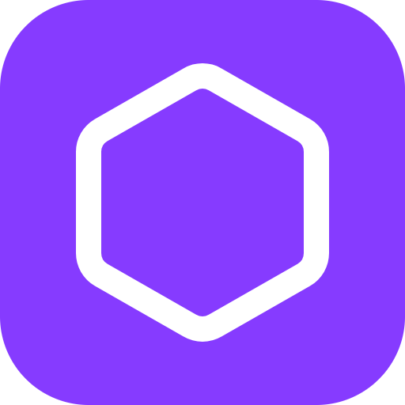
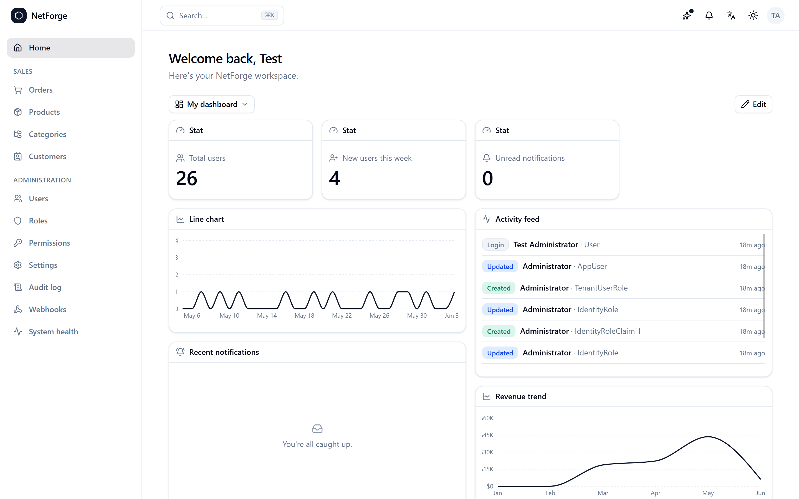

<div align="center">
  
  <h1>NetForge for Visual Studio</h1>
  <p><strong>Scaffold a production-shaped ASP.NET Core 10 + React 19 app — without leaving Visual Studio.</strong></p>
</div>

NetForge is an opinionated, beautiful-out-of-the-box starter for line-of-business apps. This extension brings
it into Visual Studio: **Tools ▸ NetForge ▸ New NetForge Project…** opens a guided dialog, and you're running.



## Features

- **New NetForge Project…** — a guided dialog under **Tools ▸ NetForge**.
- **Community scaffolds locally** with `dotnet new` — offline, no sign-in. The extension detects your .NET
  SDK and installs the `NetForge.Templates` package the first time, then opens the new solution for you.
- **A themed Pro showcase** — see what Pro unlocks (screenshots + the full feature grid) inside the IDE.
- Quick links to the **configurator**, **live demo**, and **docs**.

## Requirements

- Visual Studio **2022 (17.x)** or **2026 (18.x)**.
- The [.NET 10 SDK](https://dotnet.microsoft.com/download/dotnet/10.0) for Community scaffolding & running.

## Community vs Pro

The **Community** edition is scaffolded locally and is free forever under the MIT license. **Pro** is generated
from the [configurator](https://netforge.ebenmonney.com) after signing in, and is unlocked by any
[GitHub Sponsors](https://github.com/sponsors/emonney) tier — it adds multi-tenancy, audit, dashboards,
webhooks, global search, real-time, 2FA/OAuth, file uploads, export/import, background jobs, PWA, and a full
Sales demo domain.

## Building this extension

Requires Visual Studio with the **Visual Studio extension development** workload (the VSSDK build tooling).
`dotnet build` alone will not produce a `.vsix`. From a Developer prompt:

```
msbuild NetForge.VsExtension.csproj /t:Restore;Build /p:Configuration=Release
```

The `.vsix` lands in `bin\Release\`.

## Links

🌐 [Configurator](https://netforge.ebenmonney.com) · ▶ [Live demo](https://demo.netforge.ebenmonney.com) · 📘 [Docs](https://docs.netforge.ebenmonney.com) · 💜 [Sponsor & unlock Pro](https://github.com/sponsors/emonney)

## License

The extension is MIT-licensed. The Community template it scaffolds is MIT; the Pro edition is sponsor-licensed.
